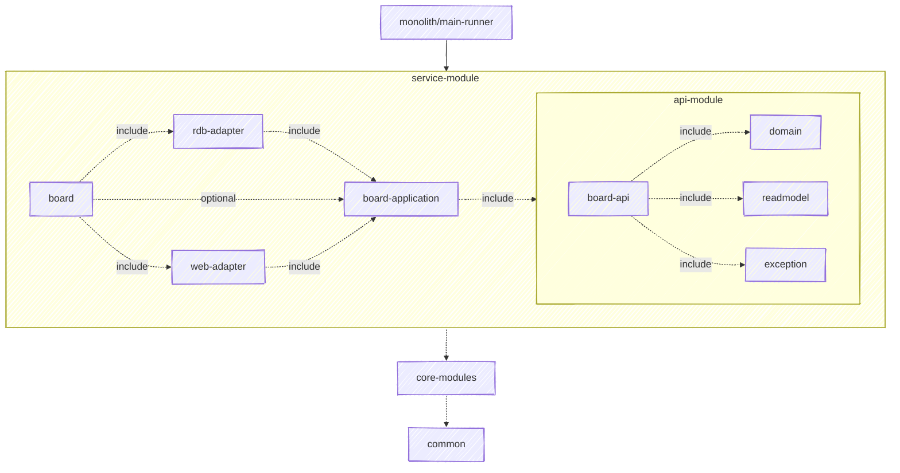

# Introduction.

이 프로젝트는 DDD 철학에 걸맞는 헥사고날 아키텍처 기반으로 멀티 모듈로 구현되었습니다.  

\*폴더 및 모듈 네이밍과 구조는 수정되고 있습니다.

```
root
├── common [:common]
├── core
│   ├── exception-handler-webmvc [:exception-handler-webmvc] 🏗
│   └── jpa-core [:jpa-core] 🏗
├── monolith
│   └── main-runner [:main-runner]
└── services    
    ├── auth [:auth]
    ├── user [:user]
```

## Inter-Module Dependencies



<details>
  <summary>설명 보기</summary>

  - 모든 서브프로젝트에 `:common` 모듈을 의존시킵니다.
  - `:board:board-api` 모듈은 다음 목록을 통합합니다. 그 외 추가 기능을 제공하지 않습니다.
    - `:board:board-domain`: 도메인 모델을 제공합니다.
    - `:board:board-exception`: 도메인 관련 예외를 제공합니다.
    - `:board:board-readmodel`: 도메인 관련 조회 모델을 제공합니다.
  - `:board:board-application` 모듈은 헥사고날 아키텍처의 각 방향 포트 인터페이스를 제공합니다.
    - `:board:board-api` 모듈을 통합합니다.
  - `:board:board-rdb-adapter` 및 `:board:board-webmvc-adapter`는 각 포트 인터페이스를 구현하거나 사용하는 어댑터를 제공합니다.
    - `:board:board-application` 모듈을 통합합니다.
  - 위 보드 관련 구현 소스 및 리소스를 모두 통합하여 `:board` 모듈을 완성합니다.
  - `:board` 모듈을 `:main-runner` 모듈이 통합하고 실행합니다.
  - 각 코어 모듈은 알맞은 모듈에서 취사선택하여 사용합니다.

</details>

<br />

# Installation and Execution

## Prerequisites

- **JDK 21**  
  You can use OpenJDK e.g. Amazon Corretto 21
- **Docker**  
  - 도커 버전이 최신 버전이 아니라면, <ins>도커 컴포즈</ins> 또한 필요할 수 있습니다.
  - 윈도우 10 사용자 중 일부는 도커가 동작하지 않을 수 있습니다. (세부 버전이 오래된 버전일 때)

<br />
  
## How to Run in a Local Environment

<br />

```
1. git clone git@github.com:nettee-space/backend-sample-multi-module.git
2. ./compose-monolith up -d
  (권한 필요 시 chmod +x compose-monolith)
3. Please include 'local' profile to your active profiles.
4. Run MainApplication!
```

<br />

# Additional Notes

## Multi-Module Project Related

<details>
  <summary>의존성 제공은 compileOnly를 선호합니다. (컨슈머 모듈이 의존성 활성화를 결정)</summary>

  <br />
  
  > - 의존 모듈: 다른 모듈에 사용되는 모듈
  > - 컨슈머 모듈: 의존 모듈을 사용하는 모듈

  <br />
  
  **Compile Only 전략**

  의존 모듈은 자신의 코드에 필요한 의존성을 `compileOnly`로 제공하는 것을 선호합니다.

  ```kotlin
  dependencies {
      compileOnly("org.example:target-artifcat:version-name")
  }
  ```
  
  - **활성화**: 컨슈머 모듈에 별도로 `implementation` 등으로 추가합니다.  
  - **비활성화**: 아무것도 추가하지 않고 무시할 수 있습니다.  
  - 이 방식은 의존성을 기입을 추가로 요구하지만, 컨슈머 모듈이 의존성 선택에 자유도를 갖습니다.

  <br />

  **API 전략**
  
  의존 모듈은 <ins>필수로 함께 사용되는 기능</ins>을 `api`로 제공합니다.
  
  - 모듈 사용을 쉽게 만들지만, 컨슈머 모듈에 기본적으로 의존성이 전이됩니다.
  - 다음 방식으로 의존성 선택에 별도로 자유도를 확보할 수 있습니다.  
    ```kotlin
    implementation(project("targetModuleName")) {
        // 단, 이러한 제외가 많아지면 가독성을 해치고 실수가 많아 관리에 까다롭습니다.
        exclude(group = "org.example", module = "unwanted-artifact")
    }
    ```

  ---

</details>

<br />

# Initial Collaboration Information

협업을 소개하는 별도 문서를 준비하지 않았습니다.
깃허브 협업은 다음을 참고하세요.

## Branch Rule 

개발자들은 다음과 같은 Branch Rule을 꼭 숙지하고 준수해 주시기 바랍니다. (간소화된 브랜치 운영)

- **main 브랜치는 읽기 전용 입니다.**
- **feature 브랜치**: 모든 변경 사항은 <ins>feature 브랜치</ins>를 생성 후, main 브랜치로 병합해야 합니다.
  - `feature/기능명` 양식으로 명명하며, 영문 소문자, 숫자 및 하이픈(케밥 케이스)를 사용합니다. (추가적인 슬래시를 사용하지 않습니다.)
    
    ```mermaid
      gitGraph
      commit
      commit
      branch feature/board-example
      branch feature/board-something
      checkout feature/board-example
      commit
      checkout feature/board-something
      commit
      commit
      checkout feature/board-example
      commit
      checkout main
      merge feature/board-example
      checkout main
      merge feature/board-something
      commit
    ```
  
- **주요 브랜치에 병합 전 Pull Request(PR)는 필수입니다.**
- 
## Commit Message

커밋 메시지의 제1 규칙은 '알아볼 수 있는 메시지 전달'입니다.  
보편적인 앵귤러 커밋 메시지 컨벤션을 따르면서, 각 포맷의 바운더리와 표현 수준은 팀에 맞게 차근차근 조정해 가면 좋겠습니다.

### Basic Commit Message Format

커밋 메시지의 첫 단어는 작업의 목적을 명확히 하기 위해 커밋 타입으로 시작합니다.  

> **type**(scope): subject in lowercase  

아래의 타입을 실습으로 사용해 보시면 좋습니다.

- **feat**: 기능 개발
- **fix**: 버그 수정
- **docs**: 문서 생성 및 수정 (README.md 등)
- **refactor**: 코드 리팩토링 (기능 변화 없음: 패키지 이동, 파일·식별자 수정 등)
- **test**: 테스트 코드 추가 또는 수정
- **chore**: 코드의 구조나 동작에 영향을 주지 않는 기타 작업
- **build**: 빌드 관련 작업, 패키지 매니저 설정 등
