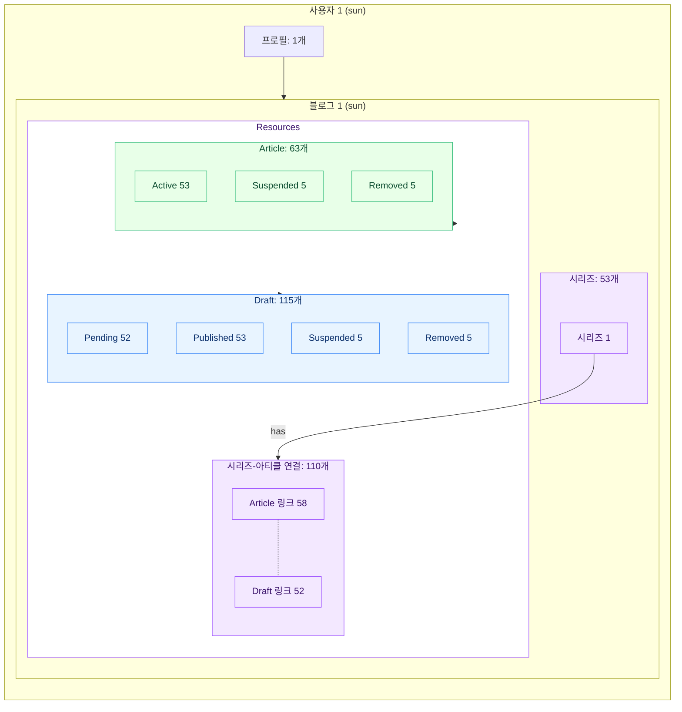
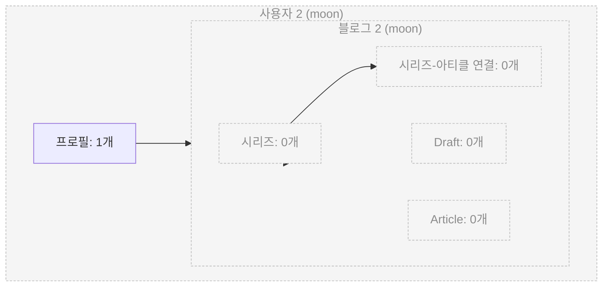

# Dummy Data

## Count

<table>
<tr>
  <th>회원 생성 초기화</th>
</tr>
<tr>
</tr>
<tr>
  <td>

- `"auth"."user"`: 2
- `"profile"."profile"`: 2
- `"blog"."blog"`: 2

  </td>
</tr>
</table>

<table>
<tr>
  <th>게시물 존재 초기화</th>
</tr>
<tr>
</tr>
<tr>
  <td>

- `"article"."draft"`: 115
- `PENDING`: 52
- `PUBLISHED`: 53
- `SUSPENDED`: 5
- `REMOVED`: 5
- `"article"."article"`: 63
  - `ACTIVE`: 53
  - `SUSPENDED`: 5
  - `REMOVED`: 5
- `"series"."series"`: 53
- `"series"."series_article"`: 110
  - Draft: 52
  - Article: 58

  </td>
</tr>
</table>

> 드래프트 블록은 아직 초기화하지 않았습니다.
 

## Allocation

사용자 1의 블로그에 모든 아티클, 드래프트, 시리즈가 존재합니다.

